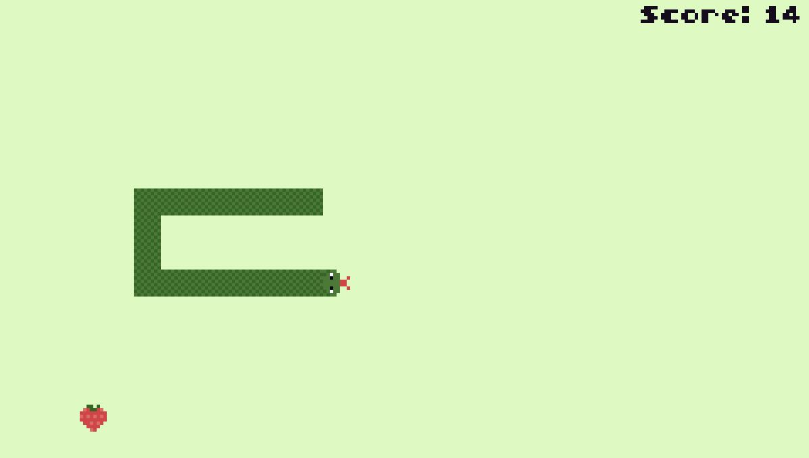

# snake80

A Snake clone written in Lua for the [TIC-80 fantasy console](https://github.com/nesbox/TIC-80).

[Play it on the TIC-80 website](https://tic80.com/play?cart=2138).

## Resources

- [TIC-80 wiki](https://github.com/nesbox/TIC-80/wiki)
- [Snake Clone tutorial](https://github.com/nesbox/TIC-80/wiki/Snake-Clone-tutorial)
